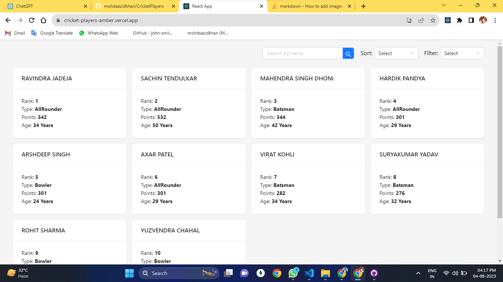

## How To Start

In the project directory, you can run:

### `npm install`

After that
### `npm start`

Runs the app in the development mode.

Open [http://localhost:3000](http://localhost:3000) to view it in your browser.

The page will reload when you make changes.

You may also see any error in the console.

## Online Preview

Open [https://cricket-players-amber.vercel.app](https://cricket-players-amber.vercel.app) to view it in your browser.

## Screenshot

